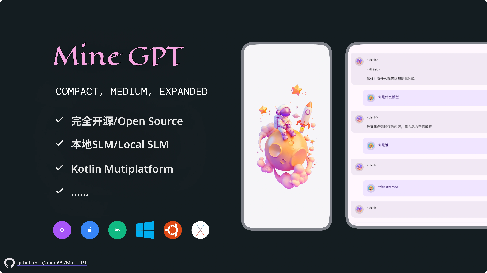
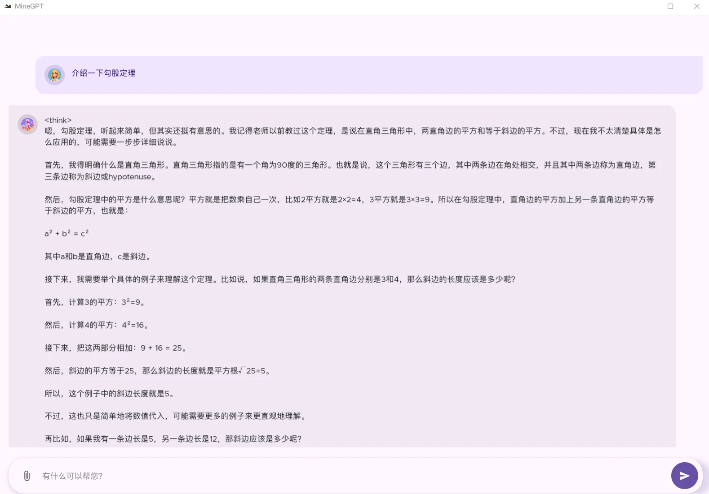
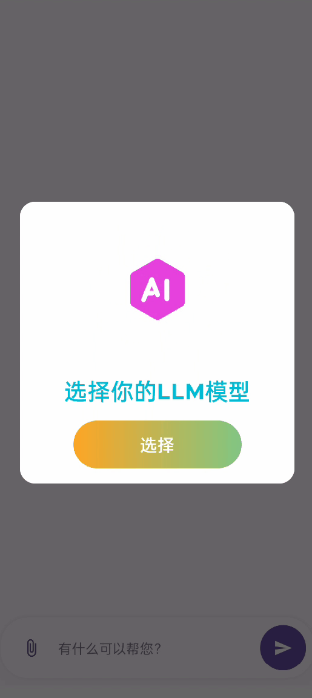
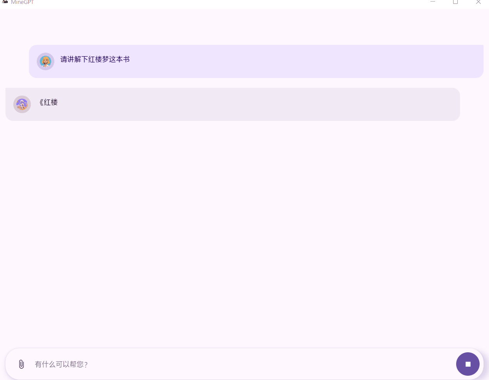

README: [English](/docs/README_EN.md) | [中文](/README.md)

## 📜 简介

MineGPT 是一个基于Kotlin Multiplatform 开发的本地小型语言模型(SLM)对话应用

## 💠 测试模型

> 可以从这里下载 https://huggingface.co/models?library=gguf

- https://huggingface.co/legraphista/Qwen2-7B-Instruct-IMat-GGUF/blob/main/Qwen2-7B-Instruct.IQ1_M.gguf
- https://huggingface.co/unsloth/DeepSeek-R1-Distill-Qwen-1.5B-GGUF/resolve/main/DeepSeek-R1-Distill-Qwen-1.5B-Q2_K.gguf

  
  

## 🎮 编译

#### Android
选择你的测试设备,直接 Run
#### Desktop
1. Android Studio, 去菜单栏 **Run** > **Edit Configurations** > **New** > **Gradle**.
2. 配置下面:
- Run: `desktopRun -DmainClass=org.onion.gpt.MainKt --quiet`

## 🚀未来计划

- 🌐 IOS支持
- 🌍 多语言
- 💾 数据存储

## 🧩 依赖组件
感谢以下开发者,谢谢你们的付出
- Kotlin Multiplatform (KMP)
- Compose Multiplatform (CMP)
- JetBrains Adaptive Layout
- JetBrains Navigation Compose
- JetBrains Lifecycle ViewModel
- Koin
- Ktor
- Coil
- Okio I/O
- llama.cpp
- FileKt
- Compottie

## 🙏 感谢

* [ggerganov/llama.cpp](https://github.com/ggerganov/llama.cpp) 是一个纯 C/C++ 框架，用于执行机器学习模型。它提供了一个原始的 C 样式 API 来与 LLM 交互转换为 GGML/llama.cpp 原生的 GGUF 格式
* [shubham0204/SmolChat-Android](https://github.com/shubham0204/SmolChat-Android) 是一个Android平台上运行SLM模型的开源项目,本项目也学习于此
