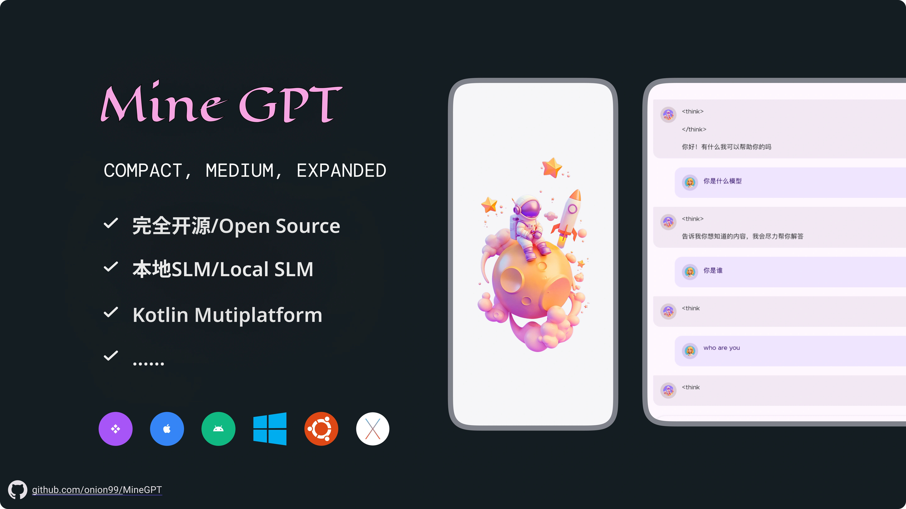
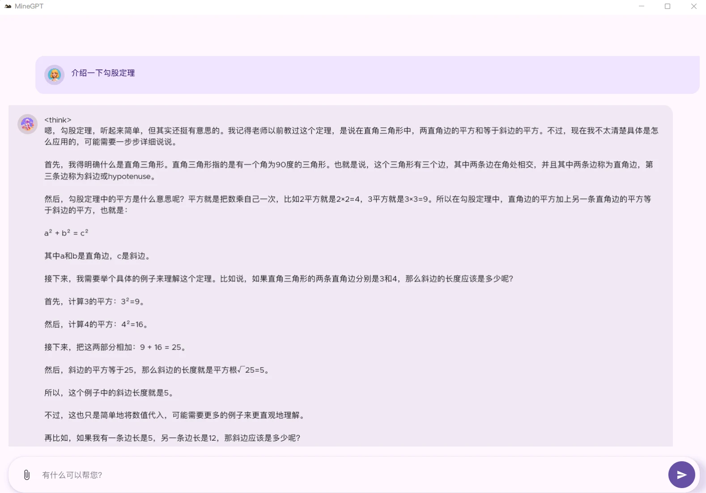
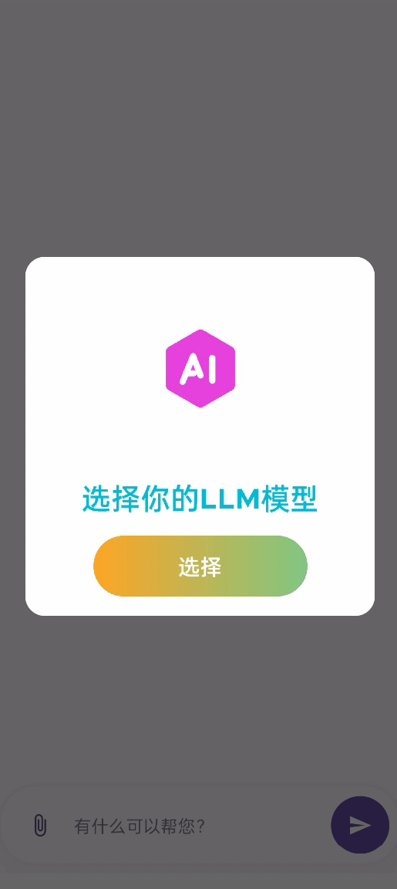

README : [中文](/docs/README_CHT.md) | [English](/README.md)

## 📜 Intro

MineGPT is a lightweight local SLM (Small Language Model) chat application built with Kotlin Multiplatform.

## 💠 Test Models

> Download from here https://huggingface.co/models?library=gguf

- https://huggingface.co/legraphista/Qwen2-7B-Instruct-IMat-GGUF/blob/main/Qwen2-7B-Instruct.IQ1_M.gguf
- https://huggingface.co/unsloth/DeepSeek-R1-Distill-Qwen-1.5B-GGUF/resolve/main/DeepSeek-R1-Distill-Qwen-1.5B-Q2_K.gguf

  
  

## 🎮 Run

#### Android
Select your test equipment and Run it
#### Desktop
1. Android Studio, go to **Run** > **Edit Configurations** > **New** > **Gradle**.
2. Configure as follows:
- Run: `desktopRun -DmainClass=org.onion.gpt.MainKt --quiet`

## 🚀 Features & Roadmap

- 🌐 IOS Support
- 🌍 Multi-Language
- 💾 Persistent data storage

## 🧩 Library
Thanks to all the contributors who made KMP/CMP possible!
- Kotlin Multiplatform (KMP)
- Compose Multiplatform (CMP)
- JetBrains Adaptive Layout
- JetBrains Navigation Compose
- JetBrains Lifecycle ViewModel
- Koin
- Coil
- llama.cpp
- FileKt
- Compottie

## 🙏 Special Thanks
* [ggerganov/llama.cpp](https://github.com/ggerganov/llama.cpp) A pure C/C++ framework for running LLMs with a simple C-style API. Supports the native GGUF format for efficient inference with GGML/llama.cpp.
* [shubham0204/SmolChat-Android](https://github.com/shubham0204/SmolChat-Android) A minimal Android application for running local SLM models. MineGPT drew valuable inspiration and ideas from this project.
